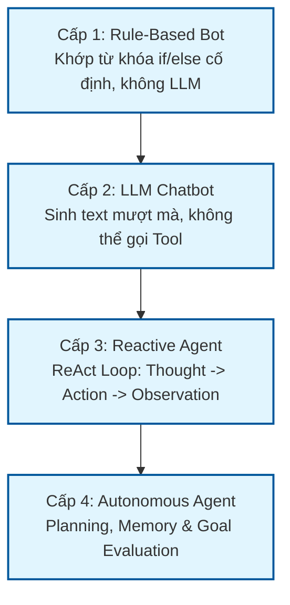
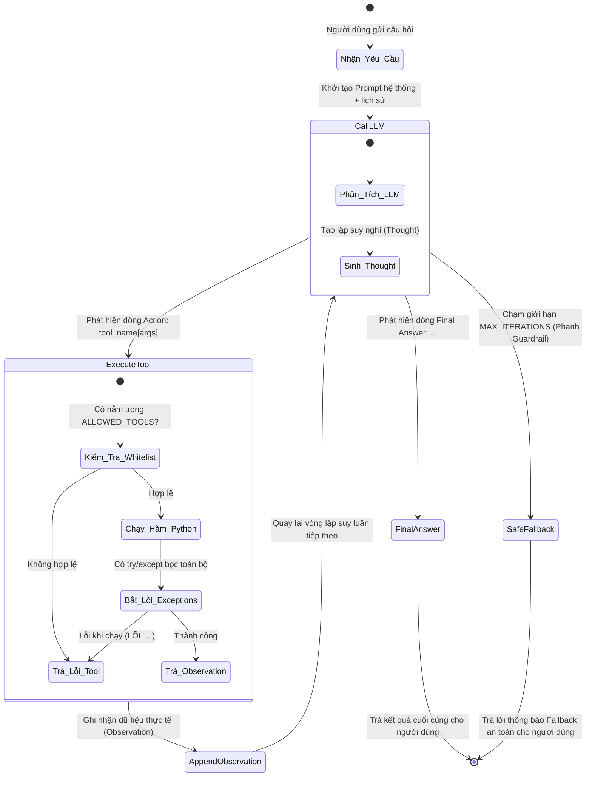
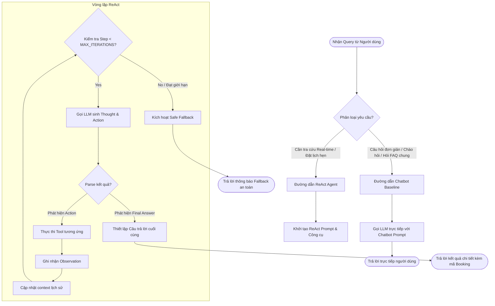
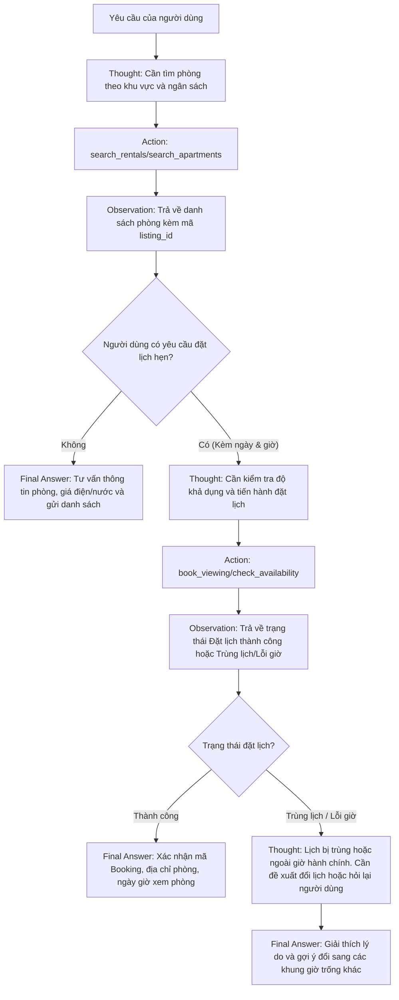
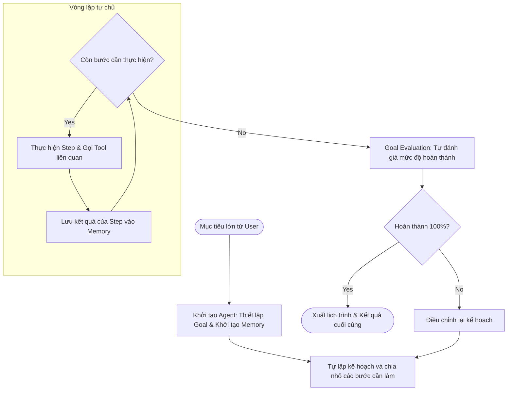

# 🧠 SƠ ĐỒ LUỒNG HOẠT ĐỘNG CỦA AI AGENT (AGENT FLOW)

Tài liệu này mô tả chi tiết luồng hoạt động (workflow), sơ đồ trạng thái (state machine) và mô hình quyết định kết hợp (hybrid decision flow) của hệ thống AI Agent trong bài Lab.

---

## 🗺️ 1. Tổng quan 4 Cấp độ Tiến hóa của Hệ thống AI
Hệ thống trải qua 4 cấp độ tăng dần về độ tự chủ và khả năng tương tác:

---

## 🔄 2. Sơ đồ trạng thái ReAct Agent Loop (Cấp độ 3)
ReAct Agent hoạt động theo vòng lặp phản hồi khép kín (closed-loop), kết hợp giữa suy luận suy nghĩ (**Thought**), thực thi công cụ (**Action**) và quan sát kết quả (**Observation**).

### Các chốt chặn An toàn (Guardrails) được áp dụng:
1. **Giới hạn số bước (`MAX_ITERATIONS = 4`)**: Tránh vòng lặp vô hạn nếu LLM bị lặp Thought-Action.
2. **Khống chế thời gian chạy (`TIMEOUT_SECONDS = 10`)**: Ngăn tool chạy quá lâu gây nghẽn luồng.
3. **Whitelist Tools**: Chỉ cho phép gọi các công cụ đã đăng ký (`search_rentals`, `book_viewing`).
4. **Bảo vệ Side-Effect**: Chỉ gọi tool thay đổi trạng thái hệ thống (`book_viewing`) khi có `listing_id` hợp lệ được sinh ra từ kết quả tra cứu thật trước đó.

---

## 🔀 3. Sơ đồ Phân luồng Quyết định kết hợp (Hybrid Decision Flowchart)
Để tối ưu chi phí (Token) và tốc độ phản hồi (Latency), hệ thống áp dụng cơ chế phân luồng Hybrid. Các câu hỏi đơn giản không cần gọi tool sẽ đi thẳng qua Chatbot thông thường.

---

## 🧠 4. Luồng hoạt động của Trợ lý Thuê phòng (Rental Agent Flow)
Đây là quy trình nghiệp vụ cụ thể cho ứng dụng tìm nhà trọ và đặt lịch xem phòng (`parking-backend-python` & `src/tools.py`):

---

## 💾 5. Sơ đồ Hoạt động của Autonomous Goal Agent (Cấp độ 4)
Cấp độ tự chủ cao nhất có khả năng tự chia nhỏ mục tiêu (Planning) và duy trì bộ nhớ (Memory).

